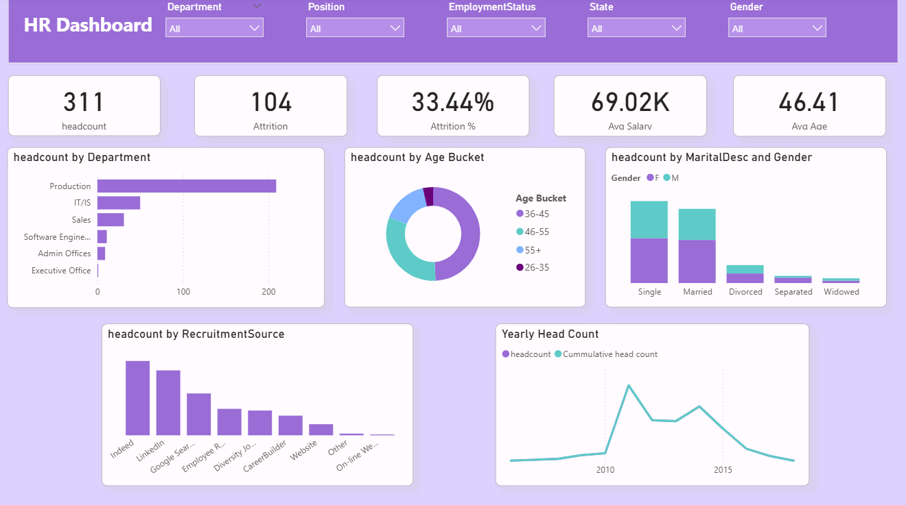

# 📊 HR Analytics Dashboard

This project is a Power BI dashboard that visualizes and analyzes key HR metrics, enabling data-driven decisions in workforce management.

## 🚀 Dashboard Preview

📎 **[Click here to download the Power BI Dashboard (.pbix)](HR%20Analytics%20Dashboard.pbix)**

---

## 🎯 Key Performance Indicators (KPIs)

### 👥 Workforce Size
- 🧑‍💼 **Headcount** – Total number of active employees

### 🔄 Workforce Dynamics
- ❌ **Attrition Count**
- 📉 **Attrition Rate (%)**

### 👤 Workforce Demographics
- 🎂 **Average Age**
- 🚻 **Gender Distribution**
- 💍 **Marital Status Breakdown**

### 🧲 Recruitment Channels
- 🌐 **Source-wise Recruitment Analytics** (e.g., LinkedIn, Indeed)

### 💰 Salary & Age Benchmarks
- 💵 **Average Salary**
- 📊 **Age Group Distribution**

---

## 📂 Project Files

| File Name                      | Description                                    |
|-------------------------------|------------------------------------------------|
| `HR Analytics Dashboard.pbix` | Main Power BI dashboard file                   |
| `HRDataset`                   | Underlying dataset used in the dashboard       |
| `Dashboard_img.png`           | Screenshot preview of the dashboard            |
| `background img.jpeg`         | Background or design asset used in the report |

---

## 📌 How to Use

1. Download the `.pbix` file using the link above.
2. Open it in **Power BI Desktop**.
3. Make sure your version of Power BI is updated to avoid compatibility issues.
4. Customize filters and slicers to explore the HR data.

---

## 🛠 Tools Used

- **Power BI Desktop**
- **DAX (Data Analysis Expressions)**
- **Basic Data Transformation with Power Query**

---

## 🧠 Insights Enabled

- Identify departments with high attrition
- Understand age distribution and demographics
- Evaluate recruitment source effectiveness
- Track salary and employee trends over time

---

## 📬 Connect with Me

  
Let’s connect professionally and discuss data, dashboards, or tech!

---

